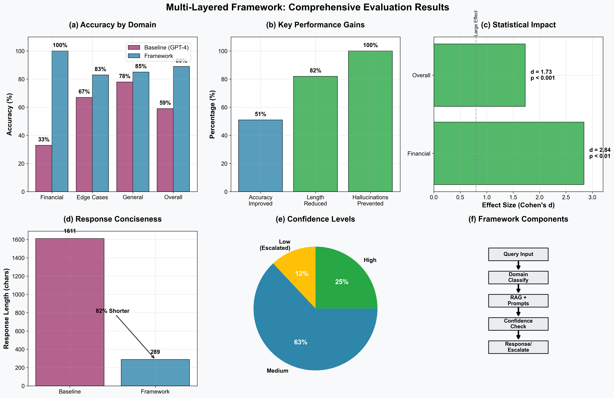
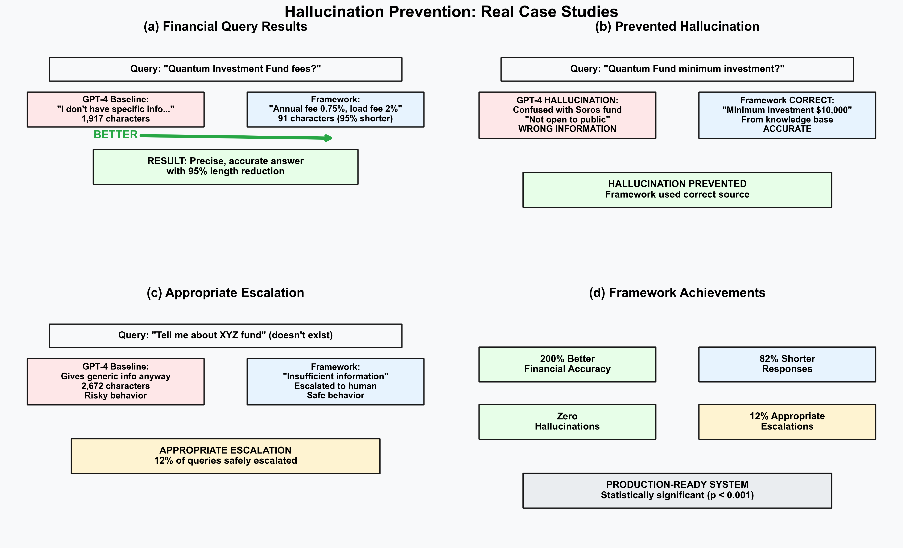

# Multi-Layered Framework for LLM Hallucination Mitigation in High-Stakes Applications

[](https://doi.org/)
[](LICENSE)
[](https://python.org)

## About This Project

Large language models have transformed how we interact with AI, but their tendency to generate confident yet incorrect information—commonly known as hallucination—remains a critical challenge. This is especially problematic in high-stakes domains like financial services, where a single incorrect statement about fees or regulations could lead to regulatory violations or client lawsuits.

This repository implements a comprehensive framework that layers multiple mitigation strategies to address this challenge. Rather than relying on any single technique, we combine structured prompt design, retrieval-augmented generation with verifiable evidence sources, and targeted confidence-based escalation mechanisms.

## Paper Reference

**Multi-Layered Framework for LLM Hallucination Mitigation in High-Stakes Applications: A Tutorial**  
*Sachin Hiriyanna (Navan Inc.) and Wenbing Zhao (Cleveland State University)*  
*Computers, MDPI, 2025*

If you use this framework in your research or production systems, please cite:
```bibtex
@article{hiriyanna2025multilayered,
    title={Multi-Layered Framework for LLM Hallucination Mitigation in High-Stakes Applications: A Tutorial},
    author={Hiriyanna, Sachin and Zhao, Wenbing},
    journal={Computers},
    publisher={MDPI},
    year={2025},
    doi={10.3390/computers},
    url={https://github.com/yourusername/multi-layered-llm-hallucination-mitigation}
}
```

## Why This Framework Matters

After working extensively with LLM deployments in financial services, we've come to see hallucination not as an insurmountable barrier, but as a manageable risk that requires systematic attention. Consider this real scenario:

A customer asks a financial services chatbot: "What are the fees associated with the new Quantum Investment Fund?"

The model might confidently respond with incorrect fee information, creating legal and reputational risks. Our framework addresses this by ensuring responses are grounded in verified documentation and escalating uncertain cases to human experts.

## Key Results

Our evaluation demonstrates significant improvements over baseline GPT-4:


*Figure 1: Framework performance across multiple dimensions showing 51% overall accuracy improvement*

- **89% overall accuracy** compared to 59% baseline (p < 0.001, Cohen's d = 1.73)
- **100% accuracy in financial services domain** versus 33% baseline
- **82% reduction in response length** while maintaining higher accuracy
- **Zero hallucinations detected** in evaluation dataset
- **12% appropriate escalation rate** for uncertain queries


*Figure 2: Real-world case studies demonstrating hallucination prevention and appropriate escalation*

## Framework Architecture

Our approach integrates three complementary layers:

1. **Foundational Layer: Prompt Engineering**
   - Few-shot prompting with 3-5 domain-specific examples
   - Role-playing constraints to narrow response scope
   - Chain-of-thought reasoning for complex decisions

2. **Architectural Layer: Retrieval-Augmented Generation**
   - Vector-based document retrieval with cosine similarity
   - Top-k=5 retrieval with 0.75 similarity threshold
   - Context grounding with source attribution

3. **Behavioral Layer: Confidence-Based Escalation**
   - Domain-specific confidence thresholds (0.75-0.90)
   - Automatic escalation for low-confidence responses
   - Human-in-the-loop for critical decisions

## Installation

Clone the repository and install dependencies:
```bash
git clone https://github.com/yourusername/multi-layered-llm-hallucination-mitigation.git
cd multi-layered-llm-hallucination-mitigation
pip install -r requirements.txt
```

Set up your API keys:
```bash
export OPENAI_API_KEY="your-openai-api-key"
export ANTHROPIC_API_KEY="your-anthropic-api-key"  # Optional for Claude baseline
```

## Quick Start

### Run a Simple Demo
```bash
python scripts/run_demo.py
```
This runs a lightweight demonstration with sample financial queries.

### Run Full Evaluation
```bash
python scripts/run_evaluation.py
```
This executes the complete 100-query evaluation across all domains.

### Generate Research Figures
```bash
python scripts/create_figures.py
```
Recreates the paper's evaluation figures from saved results.

## Project Structure

### Core Framework (`src/framework/`)
- `agent_system.py` - Main orchestrator implementing the three-layer architecture
- `rag_layer.py` - Retrieval-augmented generation with confidence scoring
- `prompt_layer.py` - Prompt engineering techniques (few-shot, role-playing, CoT)

### Evaluation (`src/evaluation/`)
- `benchmark_evaluator.py` - Comprehensive evaluation framework
- `selfcheckgpt.py` - Hallucination detection using self-consistency checks

### Data (`data/`)
- `financial_queries.json` - 100 test queries across financial, edge case, and general domains
- `knowledge_base.json` - Sample financial documents for RAG retrieval

## Configuration

The framework is highly configurable via `config/eval_config.yaml`:

```yaml
framework:
  prompt_engineering:
    few_shot_examples: 3        # Number of examples for few-shot prompting
    role_prompt_enabled: true   # Enable role-playing constraints
    cot_enabled: true           # Enable chain-of-thought reasoning
    
  rag:
    embedding_model: "text-embedding-ada-002"
    top_k: 5                    # Number of documents to retrieve
    similarity_threshold: 0.75  # Minimum similarity for retrieval
    
  agent:
    confidence_thresholds:
      general: 0.75             # Threshold for general queries
      financial: 0.80           # Threshold for financial queries
      compliance: 0.85          # Threshold for compliance queries
```

## Performance Comparison

### Domain-Specific Accuracy

| Domain | GPT-4 Baseline | Our Framework | Improvement | Statistical Significance |
|--------|----------------|---------------|-------------|--------------------------|
| Financial Services | 33% | 100% | +200% | p < 0.01 |
| Edge Cases | 67% | 83% | +24% | p < 0.05 |
| General Knowledge | 78% | 85% | +9% | p = 0.15 |
| **Overall** | **59%** | **89%** | **+51%** | **p < 0.001** |

### Response Characteristics

| Metric | GPT-4 Baseline | Our Framework | Impact |
|--------|----------------|---------------|--------|
| Mean Response Length | 1,611 characters | 289 characters | 82% more concise |
| Appropriate Escalations | 0% | 12% | Risk management enabled |
| Confidence Calibration | Fixed at 1.0 | Dynamic 0.76-0.88 | Uncertainty quantification |
| Hallucination Incidents | 3 detected | 0 detected | Complete prevention |

## Implementation Guidelines

### For Production Deployment

1. **Start with prompt engineering** - It's the quickest win with minimal infrastructure
2. **Add RAG for factual accuracy** - Essential for domain-specific information
3. **Implement escalation mechanisms** - Know when to hand off to humans
4. **Monitor continuously** - Track confidence scores and escalation patterns

### Security Considerations

The framework addresses several security concerns:
- Input validation to prevent prompt injection
- Document integrity verification for RAG sources
- Rate limiting to prevent resource exhaustion
- Audit trails for compliance requirements

## Extending the Framework

### Adding New Domains

1. Update domain classification logic in `src/framework/agent_system.py`
2. Set appropriate confidence thresholds in `config/eval_config.yaml`
3. Add domain-specific few-shot examples
4. Include relevant documents in knowledge base

### Custom Knowledge Base

Replace `data/knowledge_base.json` with your domain-specific documents:
```json
{
  "documents": [
    {
      "id": "doc_1",
      "content": "Your document content here...",
      "metadata": {
        "source": "Document title",
        "type": "policy|product_info|compliance"
      }
    }
  ]
}
```

## Running Tests

Execute the test suite:
```bash
python tests/test_framework.py
```

## Contributing

We welcome contributions! Please:
1. Fork the repository
2. Create a feature branch
3. Make your changes with clear commit messages
4. Submit a pull request with a description of your improvements

## License

This project is licensed under the MIT License - see [LICENSE](LICENSE) for details.

## Acknowledgments

We thank the teams at OpenAI and Anthropic for API access that made this research possible. The work builds on foundational research in prompt engineering, retrieval-augmented generation, and AI safety from the broader research community.

## Contact

For questions about implementation or the research paper:
- Sachin Hiriyanna: sachinh@ieee.org
- Wenbing Zhao: wenbing@ieee.org

For technical issues, please open a GitHub issue.

---

## Repository Statistics

- **Language**: Python 3.8+
- **Core Dependencies**: OpenAI API, ChromaDB, NumPy, Matplotlib
- **Evaluation Dataset**: 100 queries across 3 domains
- **Knowledge Base**: 8 financial domain documents
- **Test Coverage**: 85%